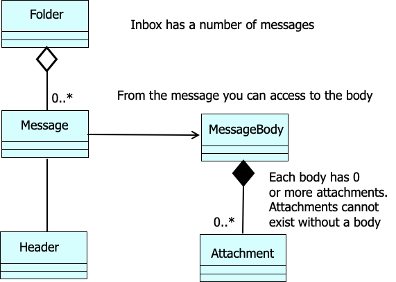
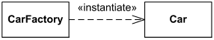
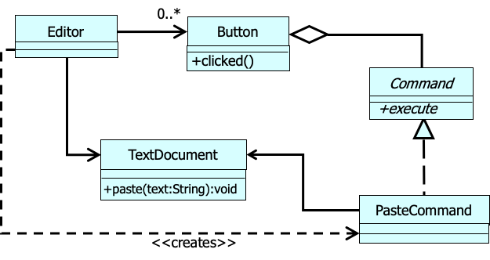

### SOLID

- Single Responsibility: a method/function should only have one responsibility
- Open close: open to extenstion but close for modifications
- Liskov Substitution: objects of a superclass should be replaceable with objects of their subclasses without breaking the application or changing the expected behavior of the program
- Interface Segregation: clients should not be forced to depend on methods they do not use
- Dependency Inversion: Client depends on the abstraction rather than concrete classes

### UML Relationship Summary

- Association
- Aggregation (it's also called a "has-a" relationship)
- Composition
- Multiplicity
- Dependency



#### Composition vs. Aggregation

- Aggregation: A kind of association that loosely suggests whole-part relationships

- Composition: A strong kind of whole-part aggregation

  A composition relationship implies:

  - An instance of the part belongs to only one composite instance at a time
  - The part must always belong to a composite
  - The composite is responsible for the creation and deletion of parts

  If the composite is destroyed, its parts must either be destroyed, or attached to another composite
  

#### Dependency

use for depicting global, parameter variable, local variable, and static-method dependency between objects

To show the type of dependency, a label can be used



CarFactory depends on the Car class. Car class could be defined without the knowledge of CarFactory class, but CarFactory requires Car for its definition because it produces Cars

Another example:



### Design pattern

- structural pattern

  - <b>adaptor</b>: making incompatible classes work together
    - aka wrapper
    - in c++, std method use adaptor frequently
  - Bridge
  - <b>Composite</b>
  - <b>Decorator</b>
  - Façade
  - Flyweight
  - proxy

- creational pattern
- behavioral pattern

### 0910 Composite Pattern

- decorator has decorator. the decorator at runtime is a linked list (omg)

```
// composition
t = new ScrollBar(t)
t = new Border(t)

// keep adding features....
```

- adding behaviors in runtime
- decoration in action: ( a ) -> ( b ) -> ( c ): execute c first, and then b, and then a
- flexible alternative to inheritance:

  - adding/removing responsibility at runtime
  - mix and match responsibility
  - decorators are simple and stackable

- can mix composite with decorators (ugly)
- adaptor vs. decorator
  - adaptor is altering existing functionalities
  - decorator is adding new functionalities
