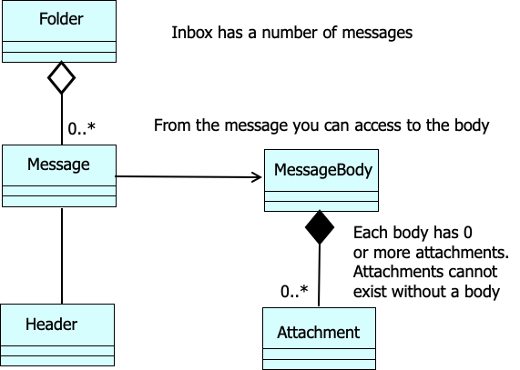
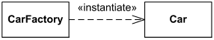
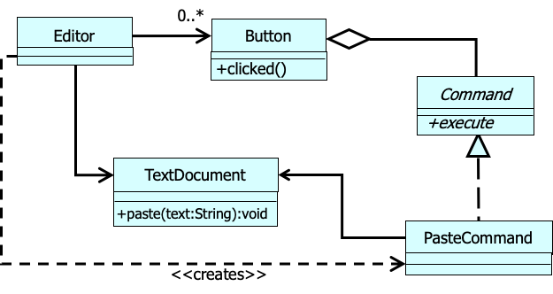

### SOLID

- Single Responsibility: a method/function should only have one responsibility
- Open close: open to extenstion but close for modifications
- Liskov Substitution: objects of a superclass should be replaceable with objects of their subclasses without breaking the application or changing the expected behavior of the program
- Interface Segregation: clients should not be forced to depend on methods they do not use
- Dependency Inversion: Client depends on the abstraction rather than concrete classes

### UML Relationship Summary

- Association
- Aggregation (it's also called a "has-a" relationship)
- Composition
- Multiplicity
- Dependency



#### Composition vs. Aggregation

- Aggregation: A kind of association that loosely suggests whole-part relationships

- Composition: A strong kind of whole-part aggregation

  A composition relationship implies:

  - An instance of the part belongs to only one composite instance at a time
  - The part must always belong to a composite
  - The composite is responsible for the creation and deletion of parts

  If the composite is destroyed, its parts must either be destroyed, or attached to another composite
  

#### Dependency

use for depicting global, parameter variable, local variable, and static-method dependency between objects

To show the type of dependency, a label can be used



CarFactory depends on the Car class. Car class could be defined without the knowledge of CarFactory class, but CarFactory requires Car for its definition because it produces Cars

Another example:



### Design pattern

- structural pattern

  - <b>adaptor</b>: making incompatible classes work together
    - aka wrapper
    - in c++, std method use adaptor frequently
  - Bridge
  - <b>Composite</b>
  - <b>Decorator</b>
  - Façade
  - Flyweight
  - proxy

- creational pattern
- behavioral pattern

### 0910 Composite Pattern

- decorator has decorator. the decorator at runtime is a linked list (omg)

```
// composition
t = new ScrollBar(t)
t = new Border(t)

// keep adding features....
```

- adding behaviors in runtime
- decoration in action: ( a ) -> ( b ) -> ( c ): execute c first, and then b, and then a
- flexible alternative to inheritance:

  - adding/removing responsibility at runtime
  - mix and match responsibility
  - decorators are simple and stackable

- can mix composite with decorators (ugly)
- adaptor vs. decorator
  - adaptor is altering existing functionalities
  - decorator is adding new functionalities

### 0915 proxy pattern

provide a <b> placeholder </b> for another object to <b> control access </b> to it

A proxy object controls access to another object, which may be:

- remote
- expensive to create
- in need of protection, require permssion
  - for example, when implementng RBA is an overkill, use a security proxy to require permssion
- or need a smart referene doing more than a simple pointer

- virtual proxy
  sometimes creating an object or calling a class is too expensive
  in java, lazy initialization (set it to null and define it later) or create an empty object and do dependency injection to it late (?)

- protection proxy
  overloading the member accesss in C++. The proxy behaves just like a pointer.
  - smart pointer in C++ (acts like proxy)
  - in c ++, if you delete a reference but don't delete it in a heap (stack), there will be memory leak
  - java has garbage collection so you don't have to worry about that
  - dangling pointer (?

The above is more about the implementation details. The key takeaway is that pointer is implementing proxy design pattern

- copy on write
  Copy-on-write (CoW) is a resource management technique where a shared data copy is only duplicated when a process or system attempts to modify it, rather than immediately duplicating all data

- related patterns
  - adaptor (proxy doesn't translate interface; it delegates the job)
  - decorator

### 0922 bridge

### 0924 flyweight

### 0924 prototype

- prototype is sort of like flyweight, but it's not shared. it cloned a new object (like p.6 slides)

### midterm

(expect one question about creational patern)
FROM DAY1 to TODAY (1006)

#### q1- know the pattern names and their intents

- structural:
  - ( ) composite: treat composite & leaf uniformly through a common interface (think network)
  - ( ) decorator: add responsibilities to objects dynamically (think coffee)
  - ( ) adaptor: convert one interface into another, so incompatible classes work togther
  - façade: provide unified interface to a set of subsystems for ease of use
  - proxy: provide a placeholder for access control, cache etc.
  - ( )bridge: decouple abstraction from implementation, so that they can vary independently
  - ( )flyweight: support large number of fined grained objects
- creational: (They rarely use constructors directly. Useful when taking advantage of polymorphism and need to choose between different classes at runtime rather than compile time)
  - ( ) singleton: ensure object has only one instance and globally accessible (lazy initialization)
  - ( )factory: define a virtual constructor in a creator class but defer object creation to subclasses
  - ( )abstract factory: create an instance from related classes without specifying concrete name
  - ( )prototype: create objects by cloning existing instances

#### q2-compare 2 patterns by giving 2- 3 similarities and 2-3 differences. when would you use x rather then y

- flyweight & prototype

#### q3-given a UML what pattern is it? Draw a sequence diagram to show how xx operates

#### q4-given 3-4 scenarios, what pattern suits best why?

#### q5 and q6: given a scenario, solve the problem. give patten name, explain why. give uml, give pattern related code, give client code
