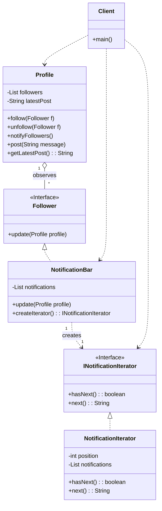

# HW6 - Question 1: Solution

This document provides a unified solution for Question 1, explaining how the **Observer** and **Iterator** patterns work together to build the required functionality.

### 1. Design Pattern Names
1.  **Observer Pattern (Pull Model):** For the notification mechanism.
2.  **Iterator Pattern:** For iterating through the collected notifications.

### 2. Rationale for Combined Design
The problem describes a system with two distinct user stories:
1.  A user's followers must be notified when the user posts an update.
2.  A user must be able to view their collected notifications without knowing how the collection is stored.

These two requirements are addressed by a combination of two behavioral patterns:

-   **Observer Pattern:** This pattern is a perfect fit for the notification system. It creates a clean, decoupled relationship where the `Profile` (the Subject) can notify multiple `NotificationBar` objects (the Observers) of state changes (new posts) without being tightly coupled to them. The specified **pull model** is used, where observers are given a reference to the subject and are responsible for fetching the data they need.

-   **Iterator Pattern:** This pattern is explicitly designed to solve the second requirement. It provides a standard way to traverse the items in a collection (the notifications within a `NotificationBar`) while completely hiding the collection's internal implementation (e.g., `ArrayList`, `LinkedList`, array). This decouples the notification rendering logic from the notification storage logic.

The two patterns work together seamlessly: the Observer pattern is responsible for *adding* items to the collection, and the Iterator pattern is responsible for *retrieving* them.

### 3. UML Class Diagram

### 5. How the Design Solves the Problem
The integrated design works as follows:

1.  A `Profile` (Subject) maintains a list of `Follower` objects (Observers). A `NotificationBar` is a concrete implementation of a `Follower`.
2.  When a user posts a message, the `Profile`'s `post()` method is called. This method updates the profile's state and then calls `notifyFollowers()`.
3.  `notifyFollowers()` iterates through all registered followers and calls their `update()` method. This is the **Observer** pattern in action.
4.  The `NotificationBar`'s `update()` method receives a reference to the `Profile` object, pulls the latest post data, formats a notification string, and adds it to its internal private list of notifications.
5.  When the user wants to view their feed, client code calls the `NotificationBar`'s `createIterator()` method. This is the start of the **Iterator** pattern.
6.  The client receives an `INotificationIterator` object and uses its `hasNext()` and `next()` methods to loop through all the notifications and display them, without ever knowing how that list is implemented internally.

This combined design fully solves the problem by creating a decoupled, robust, and maintainable system.

### 6. SOLID Principles Evaluation

-   **Single Responsibility Principle (SRP):** This design adheres to SRP. The `Profile`'s responsibility is user state management. The `NotificationBar`'s responsibility is to be a collection of notifications. The `NotificationIterator`'s responsibility is traversal. Each class has one clear job.
-   **Open/Closed Principle (OCP):** The system is open to extension and closed for modification. New types of followers can be added without changing the `Profile` class. New types of iterators (e.g., a reverse iterator) could be added without changing the `NotificationBar` or its clients.
-   **Liskov Substitution Principle (LSP):** Any object implementing the `Follower` or `INotificationIterator` interfaces can be used interchangeably, adhering to LSP.
-   **Interface Segregation Principle (ISP):** The interfaces (`Follower`, `INotificationIterator`) are small, cohesive, and purpose-driven, adhering to ISP.
-   **Dependency Inversion Principle (DIP):** The design relies heavily on abstractions. `Profile` depends on the `Follower` interface, and the client code depends on the `INotificationIterator` interface. This decoupling is a core strength of the design.
