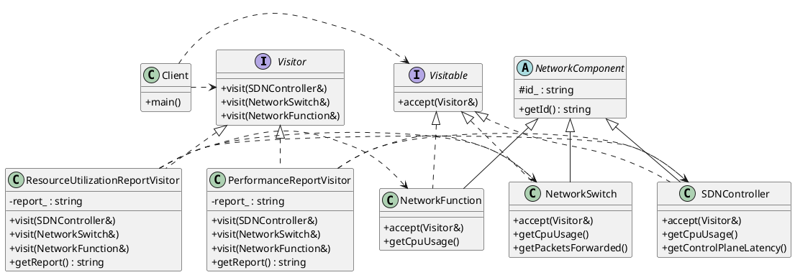

# Design Document: SDN Reporting System

This document answers the questions presented in the problem description, based on the provided C++ implementation.

### 1. Give the name of the design pattern(s) you are applying to the problem.

The primary design pattern used is the **Visitor** pattern.

### 2. Present your reasons why your chosen pattern(s) solve the problem.

The Visitor pattern is ideal for this problem because it directly addresses the core requirements of **extensibility** and **low coupling**.

-   **Extensibility**: The problem requires that "it must be easy to add new, future reports ... with minimal effort."
    -   The Visitor pattern achieves this by separating the reporting algorithms (the "operations") from the network component objects they operate on.
    -   To add a new report, like a `SecurityAuditReport`, we simply create a new concrete visitor class (`SecurityAuditReportVisitor`) that implements the `Visitor` interface. The existing component classes (`SDNController`, `NetworkSwitch`, etc.) do not need to be modified at all.

-   **Low Coupling**: The problem states that "core component classes ... should be minimally impacted, if at all, by the addition of new reporting types."
    -   The component classes (the "elements") only need to know about the abstract `Visitor` interface, not the concrete report types. They are completely decoupled from the logic of generating reports.
    -   The only addition to the component classes is the `accept(Visitor&)` method. This is a small, one-time change that enables the pattern.

**Alternative Pattern**: An alternative would be to place the reporting logic directly inside the component classes. For instance, we could have methods like `generateResourceReport()` and `generatePerformanceReport()` in each component class. However, this approach is inferior because adding a new report type would require modifying *every single component class*, which violates the Open/Closed Principle and leads to a rigid and hard-to-maintain design. The Visitor pattern elegantly avoids this issue.

### 3. Show you design with a UML class diagram.

Here is a UML class diagram representing the Visitor pattern implementation for the SDN reporting system.



### 4. Give Java or C++ code for your design showing how you have implemented the pattern.

The C++ implementation is provided in the `main.cpp` file. The key aspects of the pattern are highlighted below:

```cpp
// Visitor interface
class Visitor {
public:
    virtual ~Visitor() = default;
    virtual void visit(SDNController& controller) = 0;
    virtual void visit(NetworkSwitch& sw) = 0;
    virtual void visit(NetworkFunction& nf) = 0;
};

// Visitable interface
class Visitable {
public:
    virtual ~Visitable() = default;
    virtual void accept(Visitor& visitor) = 0;
};

// A concrete Visitable element
class SDNController : public NetworkComponent, public Visitable {
public:
    explicit SDNController(const std::string& id) : NetworkComponent(id) {}

    // The accept method is the entry point for the visitor.
    void accept(Visitor& visitor) override {
        // It calls the correct visit method on the visitor (double dispatch).
        visitor.visit(*this);
    }
    // ... other methods
};

// A concrete Visitor
class ResourceUtilizationReportVisitor : public Visitor {
public:
    void visit(SDNController& controller) override {
        report_ += "SDNController (" + controller.getId() + "):\n";
        report_ += "  CPU Usage: " + std::to_string(controller.getCpuUsage()) + "%\n";
        // ...
    }
    // ... other visit methods

    std::string getReport() const {
        return "--- Resource Utilization Report ---\n" + report_;
    }
private:
    std::string report_;
};

// Client usage of the pattern
int main() {
    std::vector<std::unique_ptr<Visitable>> visitable_components;
    visitable_components.push_back(std::make_unique<SDNController>("Controller1"));
    visitable_components.push_back(std::make_unique<NetworkSwitch>("Switch1"));
    // ...

    // --- Generate Resource Utilization Report ---
    ResourceUtilizationReportVisitor resourceVisitor;
    for (const auto& elem : visitable_components) {
        elem->accept(resourceVisitor);
    }
    std::cout << resourceVisitor.getReport() << std::endl;

    return 0;
}
```

### 5. Explain how this design solves the problem, using the specific names and roles of your designed classes.

This design effectively solves the problem by decoupling the data structure (network components) from the operations performed on it (reporting).

-   The network components (`SDNController`, `NetworkSwitch`, `NetworkFunction`) are the **Visitable Elements**. They are unaware of the reporting logic. Their only pattern-related role is to implement the `accept(Visitor&)` method, which delegates the operation to the incoming `visitor` object.

-   The reports are implemented as **Concrete Visitors** (`ResourceUtilizationReportVisitor`, `PerformanceReportVisitor`). Each visitor encapsulates the algorithm for a specific report. For example, `ResourceUtilizationReportVisitor` knows how to call methods like `getCpuUsage()` and `getMemoryStat()` on the components to gather the data it needs.

-   When the **Client** (`main` function) needs to generate a report, it creates the appropriate visitor (e.g., `performanceVisitor`) and iterates through the list of `visitable_components`. For each component, it calls `elem->accept(performanceVisitor)`.

This `accept` call triggers a "double dispatch":
1.  The first dispatch is the virtual call to `accept()`, which resolves to the concrete component's implementation (e.g., `NetworkSwitch::accept()`).
2.  The second dispatch happens inside `accept()`, where `visitor.visit(*this)` is called. This resolves to the visitor's specific method for that component type (e.g., `PerformanceReportVisitor::visit(NetworkSwitch&)`).

This mechanism allows us to add new functionality (reports) just by adding new visitor classes, achieving the primary goals of extensibility and low coupling.

### 6. Evaluate your design with respect to SOLID principles.

-   **S - Single Responsibility Principle (SRP)**: This principle is well-adhered to.
    -   The **component classes** (`SDNController`, etc.) are responsible only for representing the state and core functions of that network device.
    -   The **visitor classes** (`ResourceUtilizationReportVisitor`, etc.) each have the single responsibility of generating one specific type of report.

-   **O - Open/Closed Principle (OCP)**: This is the main strength of the Visitor pattern and is perfectly satisfied.
    -   The system is **open to extension**: we can add any number of new reports by creating new visitor classes.
    -   The system is **closed for modification**: the component classes do not need to be changed to support these new reports.

-   **L - Liskov Substitution Principle (LSP)**: This principle is upheld.
    -   The client code iterates over a collection of `Visitable` pointers. The behavior of the `accept` method is consistent across all subtypes (`SDNController`, `NetworkSwitch`), so they are perfectly substitutable.
    -   Likewise, any concrete visitor can be used where a `Visitor` is expected.

-   **I - Interface Segregation Principle (ISP)**: This is a point of contention for the Visitor pattern.
    -   The `Visitor` interface requires a `visit` method for every concrete `Visitable` type. This means a new visitor (e.g., `PerformanceReportVisitor`) must implement a `visit` method for `NetworkFunction` even if it does nothing with it. This can be seen as a minor violation of ISP, as the visitor is forced to depend on methods it doesn't use. However, for a small and stable set of component classes, this is a reasonable trade-off.

-   **D - Dependency Inversion Principle (DIP)**: This principle is followed correctly.
    -   High-level modules (the component classes and the client) depend on abstractions (`Visitor` and `Visitable`), not on low-level concrete implementations. The concrete visitors also depend on the component abstractions (via their public interfaces), not their implementation details.

```